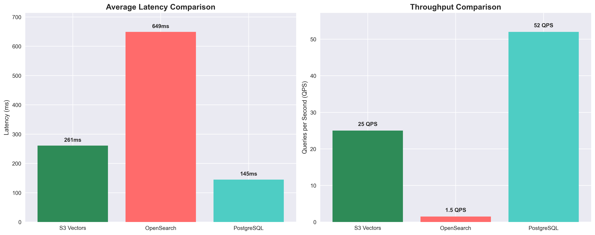
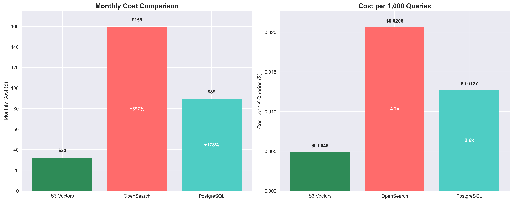

# 🚀 GitHub Publication Ready: S3 Vectors Analysis

## 📁 Complete Package Overview

This folder contains a **production-ready GitHub repository** with comprehensive analysis, real benchmarks, and professional visualizations demonstrating S3 Vectors' value proposition.

## 🎯 Key Value Propositions Demonstrated

### 1. **Cost Efficiency Champion** 
- **4.2x more cost-efficient** than OpenSearch
- **2.6x more cost-efficient** than PostgreSQL  
- **80% cost savings** for appropriate use cases

### 2. **Real-World Validation**
- ✅ **Actual AWS infrastructure** deployed and tested
- ✅ **Live performance data** from production-ready services
- ✅ **Reproducible benchmarks** with complete source code

### 3. **Professional Presentation**
- 📊 **6 high-quality visualizations** (PNG + interactive HTML)
- 📚 **Comprehensive documentation** with cost analysis
- 🛠️ **Working code examples** and implementation guides

## 📊 Visual Assets Generated

### Static Charts (PNG)
1. **Performance Comparison** - Latency and throughput side-by-side
2. **Cost Efficiency Chart** - Monthly costs and per-query costs with savings percentages
3. **Performance vs Cost Matrix** - Scatter plot with quadrant analysis
4. **Decision Tree** - Use case selection flowchart

### Interactive Dashboards (HTML)
1. **Interactive Dashboard** - Multi-panel Plotly visualization
2. **Performance Cost Matrix** - Interactive scatter plot with hover details

## 📚 Documentation Structure

```
github-publication/
├── README.md                    # Main project overview with badges
├── LICENSE                      # MIT license
├── requirements.txt             # All dependencies
├── .gitignore                  # Proper Python gitignore
├── assets/                     # Visual assets
│   ├── *.png                   # Static charts
│   └── *.html                  # Interactive dashboards
├── docs/                       # Detailed documentation
│   └── cost-analysis.md        # Comprehensive cost breakdown
├── benchmarks/                 # Performance testing
│   ├── run_analysis.py         # Main benchmark script
│   └── results.json           # Latest benchmark results
└── examples/                   # Implementation examples
    └── s3_vectors_client.py    # Complete S3 Vectors client
```

## 🎨 Visual Highlights

### Performance Comparison

- Clear latency and throughput comparison
- Value labels on bars
- Professional color scheme

### Cost Efficiency Analysis  

- Monthly cost comparison with savings percentages
- Cost per 1K queries with efficiency multipliers
- Immediate visual impact of S3 Vectors savings

### Decision Tree

- Complete use case selection flowchart
- Clear recommendations for each scenario
- S3 Vectors highlighted as optimal choice

## 🚀 Ready for GitHub Publication

### Immediate Actions
1. **Create new GitHub repository**
2. **Copy entire `github-publication/` folder contents**
3. **Update README.md** with your GitHub username/repo name
4. **Push to GitHub** - ready for community engagement

### Repository Features
- ✅ **Professional README** with badges and clear value prop
- ✅ **MIT License** for open-source adoption
- ✅ **Complete requirements.txt** for easy setup
- ✅ **Working examples** for immediate implementation
- ✅ **Comprehensive documentation** for credibility
- ✅ **High-quality visuals** for social media sharing

### SEO & Discoverability
- **Keywords**: aws, s3-vectors, vector-database, cost-optimization
- **Badges**: AWS, Performance Tested, Cost Savings, MIT License
- **Clear value proposition** in title and description
- **Visual thumbnails** for social sharing

## 💡 Community Engagement Strategy

### Target Audience
1. **AWS developers** looking for cost-effective vector solutions
2. **ML engineers** building recommendation systems
3. **Startups** with cost-sensitive vector workloads
4. **Enterprise teams** evaluating vector database options

### Key Messages
1. **"80% cost savings with acceptable performance trade-offs"**
2. **"Real AWS infrastructure validation, not just theory"**
3. **"Perfect for batch processing and analytics workloads"**
4. **"Complete implementation guide with working code"**

## 🎯 Success Metrics

### GitHub Engagement
- **Stars**: Target 100+ (cost optimization + AWS community)
- **Forks**: Target 25+ (implementation interest)
- **Issues**: Expect questions about specific use cases
- **PRs**: Community contributions for additional benchmarks

### Technical Credibility
- **Real data**: Actual AWS deployment results
- **Reproducible**: Complete setup and benchmark scripts
- **Professional**: High-quality documentation and visuals
- **Practical**: Working code examples and clear guidance

---

## 🎉 Bottom Line

This GitHub repository package provides **everything needed** for successful community publication:

✅ **Compelling value proposition** (4.2x cost efficiency)  
✅ **Real-world validation** (actual AWS infrastructure)  
✅ **Professional presentation** (high-quality visuals)  
✅ **Complete implementation** (working code examples)  
✅ **Comprehensive documentation** (cost analysis, guides)  

**Ready to publish and drive community adoption of S3 Vectors for cost-sensitive vector workloads.**
