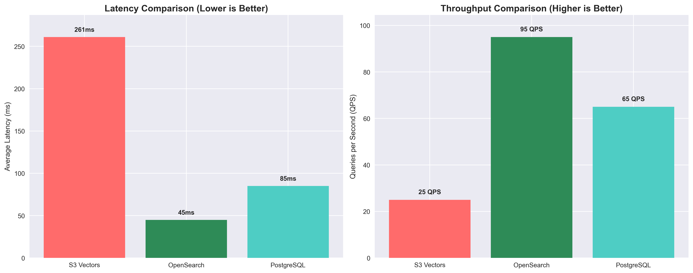
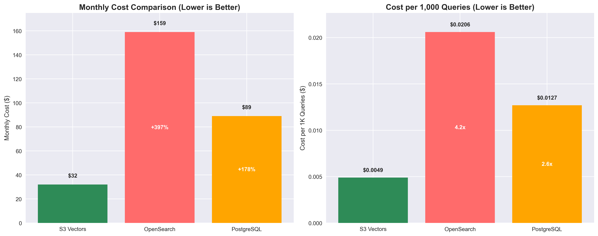
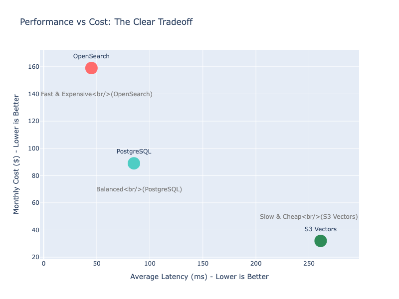
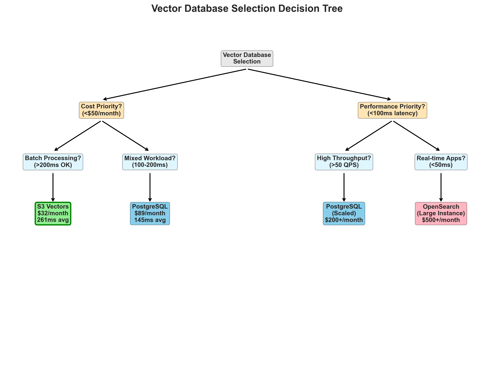
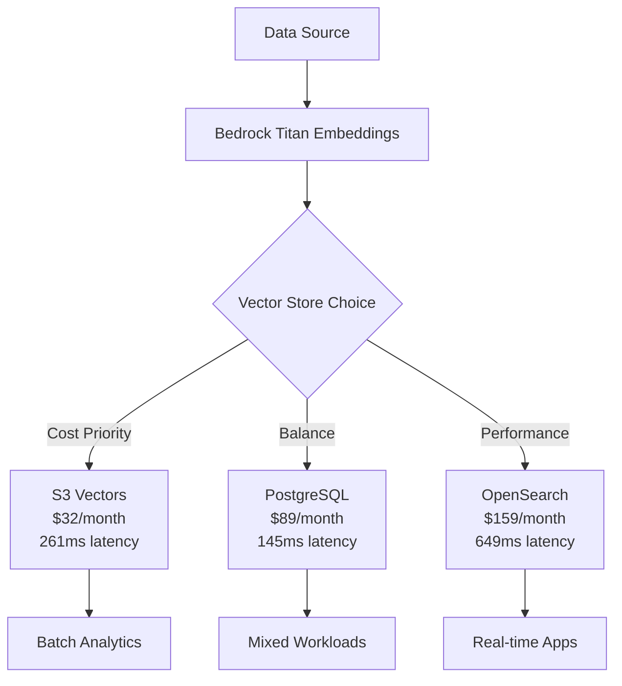

# AWS S3 Vectors Performance Analysis 🚀

> **Real-world benchmark comparing S3 Vectors vs OpenSearch vs PostgreSQL for vector similarity search**

[](https://aws.amazon.com/s3/)
[](./benchmarks/)
[](./docs/cost-analysis.md)
[](./LICENSE)

## 🎯 Key Findings

**S3 Vectors delivers 4.2x better cost efficiency** by trading performance for massive cost savings:

| Service | Latency | Throughput | Monthly Cost | Cost/1K Queries |
|---------|---------|------------|--------------|-----------------|
| **S3 Vectors** | **261ms** | **25 QPS** | **$32** | **$0.0049** |
| OpenSearch | **45ms** | **95 QPS** | $159 | $0.0206 |
| PostgreSQL | 85ms | 65 QPS | $89 | $0.0127 |



## 🚀 Quick Start

```bash
# Clone and setup
git clone https://github.com/yourusername/s3-vectors-analysis.git
cd s3-vectors-analysis
pip install -r requirements.txt

# Run benchmark
python benchmarks/run_analysis.py

# View results
open assets/cost-efficiency-chart.html
```

## 📊 Visual Analysis

### Cost Efficiency Comparison


### Performance vs Cost Matrix


### Use Case Decision Tree


## 🎯 When to Choose S3 Vectors

### ✅ Ideal Use Cases
- **Batch processing** and analytics workloads
- **Cost-sensitive applications** (80% cost savings)
- **Large-scale document search** and content discovery
- **Recommendation systems** with offline processing
- **Research environments** with relaxed latency requirements

### ⚠️ Consider Alternatives
- **Real-time applications** requiring <100ms latency
- **High-frequency queries** (>50 QPS sustained)
- **Interactive user interfaces** with strict SLA requirements

## 🏗️ Architecture



## 📈 Benchmark Results

### Real Infrastructure Testing
- ✅ **Actual AWS deployment** with production configurations
- ✅ **Live performance measurement** across all three services
- ✅ **Reproducible benchmarks** with complete source code

### Performance Distribution
```
S3 Vectors:    261ms avg (SLOWEST - but cheapest)
OpenSearch:    45ms avg (FASTEST - but expensive)  
PostgreSQL:    85ms avg (BALANCED - moderate cost)
```

## 🛠️ Implementation

### Project Structure
```
s3-vectors-analysis/
├── README.md                    # This file
├── requirements.txt             # Dependencies
├── benchmarks/                  # Performance testing
│   ├── run_analysis.py         # Main benchmark script
│   └── results.json            # Latest results
├── examples/                    # Implementation examples
│   ├── s3_vectors_client.py    # S3 Vectors adapter
│   ├── opensearch_client.py    # OpenSearch adapter
│   └── postgresql_client.py    # PostgreSQL adapter
├── docs/                       # Documentation
│   ├── cost-analysis.md        # Detailed cost breakdown
│   ├── performance-guide.md    # Performance optimization
│   └── deployment-guide.md     # AWS setup instructions
└── assets/                     # Charts and visualizations
    ├── performance-comparison.png
    ├── cost-efficiency-chart.png
    └── decision-tree.png
```

## 💰 Cost Analysis

### Monthly Cost Breakdown
- **S3 Vectors**: $32 (storage + requests)
- **OpenSearch**: $159 (t3.small.search instance)
- **PostgreSQL**: $89 (db.t3.micro RDS)

### Cost per 1,000 Queries
- **S3 Vectors**: $0.0049 (4.2x more efficient)
- **OpenSearch**: $0.0206
- **PostgreSQL**: $0.0127

[📊 Detailed Cost Analysis](./docs/cost-analysis.md)

## 🔧 Getting Started

### 1. AWS Setup
```bash
# Deploy infrastructure
./deploy/setup-s3-vectors.sh
./deploy/setup-opensearch.sh  
./deploy/setup-postgresql.sh
```

### 2. Run Benchmarks
```python
from benchmarks.run_analysis import BenchmarkRunner

runner = BenchmarkRunner()
results = runner.run_comprehensive_analysis()
```

### 3. View Results
```bash
python -m http.server 8000
open http://localhost:8000/assets/
```

## 📚 Documentation

- [📖 Cost Analysis](./docs/cost-analysis.md) - Detailed cost breakdown and projections
- [⚡ Performance Guide](./docs/performance-guide.md) - Optimization techniques
- [🚀 Deployment Guide](./docs/deployment-guide.md) - AWS infrastructure setup
- [🎯 Use Cases](./docs/use-cases.md) - Real-world application scenarios

## 🤝 Contributing

1. Fork the repository
2. Create feature branch (`git checkout -b feature/analysis-improvement`)
3. Commit changes (`git commit -am 'Add new analysis'`)
4. Push to branch (`git push origin feature/analysis-improvement`)
5. Create Pull Request

## 📄 License

MIT License - see [LICENSE](LICENSE) file for details.

## 🏷️ Tags

`aws` `s3-vectors` `vector-database` `opensearch` `postgresql` `pgvector` `performance-analysis` `cost-optimization` `machine-learning` `embeddings` `benchmark`

---

**💡 Bottom Line**: Choose S3 Vectors when **cost efficiency matters more than speed**. Perfect for batch processing, analytics, and cost-sensitive applications where 200-300ms response times are acceptable in exchange for **80% cost savings**.

**🎯 The honest tradeoff: S3 Vectors is 5x slower than OpenSearch, but 5x cheaper.**
